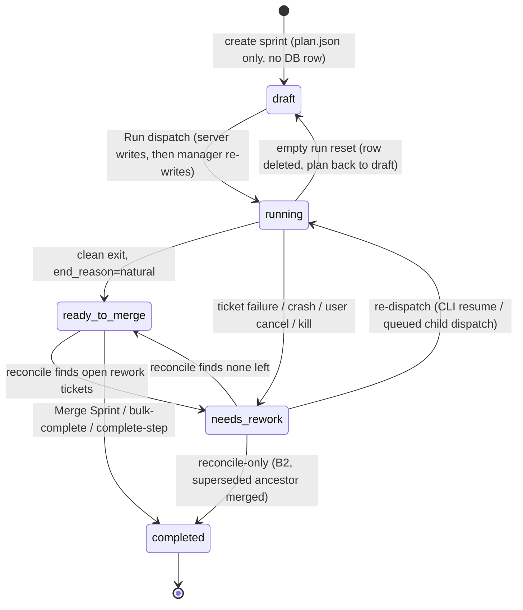

# Sprint Lifecycle — Source of Truth, States, Merge Model

> **Status:** implemented (P0–P4 landed, sprints 73.x); this document is now the
> **as-built contract** — updated 2026-07-02 to match code, with deviations from
> the original 2026-06-12 design called out inline as *(deviation)* and open
> decisions as *(open question)*. Tracker:
> [`../milestones/sprint-lifecycle-redesign.md`](../milestones/sprint-lifecycle-redesign.md).
> Drafted 2026-06-12 from the
> sprint-68.x retrospective (issue #894 / sprint-68.6 ran three times on one
> label and showed Completed, Cancelled, 0 tickets, and a 44-minute wall time
> simultaneously across panes). This document is the contract for the fix
> tickets; companion to [`boundaries.md`](./boundaries.md),
> [`frontend-map.md`](./frontend-map.md), and the store-level contract in
> [`1_state-and-source-of-truth.md`](./1_state-and-source-of-truth.md) §§ 1.5–1.7.

## Canonical Read Contract (issue #1091)

**`sprint_state.current(label)` is the sole sanctioned way to read sprint
lifecycle state.**

```python
from apps.dashboard import sprint_state
state = sprint_state.current("sprint-74.1")  # e.g. "running", "needs_rework"
```

Internally it calls `canonical_lifecycle(db.get_sprint(label)["state"])`.

Rules for all call sites:

- **Zero disk reads.** No `plan.json`, no `-state.json`, no `-pid` file.
- **Zero label inference.** No GitHub label lookups.
- **Zero fallback logic.** DB is the only source. A missing row returns
  `"unknown"`.

Existing call sites that read plan.json, infer state from labels, or apply
multi-source reconciliation must be migrated to `sprint_state.current()` in
subsequent tickets. Do not add new call sites that bypass this accessor.

**Known gaps in the contract as of 2026-07-02** *(open questions)*:

- **Fixed (#1692):** the duplicate accessor at
  `apps/dashboard/routers/sprint_state.py` (returned `None` for a missing row
  vs `"unknown"`) is deleted; `apps/dashboard/sprint_state.py` is now the sole
  accessor.
- **plan.json is still load-bearing** on lifecycle paths: the terminal-label
  redispatch guard trusts a terminal plan.json when no DB row exists
  (`startup.py` `_reject_terminal_label_redispatch`), and the reconcile orphan
  sweep rewrites it.
- **Fixed (#1693):** sprint creation and the `auto_run=false` rerun-queue path
  now write a `draft` DB row via `db.ensure_sprint_draft_row()` alongside
  their plan.json writes, so `sprint_state.current()` sees them immediately
  instead of relying on the missing-row-implies-draft fallback. That fallback
  still exists for legacy/pre-#1693 sprints and any other unforeseen gap —
  it's a safety net now, not the primary path.

## Problem — Four Competing Truths

Today one sprint's status is answered by four disconnected sources, and they
disagree during re-runs, crashes, and dashboard restarts:

| Source | Read by | Example disagreement (sprint-68.6) |
|--------|---------|------------------------------------|
| `GET /api/sprints/:label/outcome` (reads `sprint-N-state.json` + summary `.md`) | Board pane | `completed`, wall 150s |
| `GET /api/sprints/history` (DB `sprints` + `sprint_history` tables + disk fallback) | History pane | `completed`, duration 218s, **0 tickets** |
| `GET /api/sprints/:label/run-stats` (DB `agent_runs`, all attempts) | History expanded card | wall **2670s**, failed coder segments on a "completed" sprint |
| Disk (`plan.json`, `<label>.json`, `-state.json`, `-status.json`) | Everything, at render time | `cancelled` after an orphan-PID sweep, then `completed` |

Root causes: same-label re-dispatch (three attempts under one label), four
state vocabularies (`plan.json` state, DB lifecycle, outcome pane-state,
summary status), and render-time disk reads racing the sprint manager.

## Source-of-Truth Architecture

**GitHub is the truth for state. The local DB is the truth for metrics. Disk
is a write-once run artifact, never read at render time.**

| Layer | Owns | Examples |
|-------|------|----------|
| GitHub | Sprint/ticket state, lineage, review status | issue open/closed, `sprint-68.6` label, `UAT` label, `need-rework` label, PRs, summary issue |
| Local DB | Runtime metrics GitHub never has | durations, per-agent timings, tokens, gantt segments (`agent_runs`, `sprints` tables) |
| Disk (`.commander/sprints/*`) | Sprint-manager runtime artifacts | written during a run, ingested into the DB once at end-of-run |

### Refresh flow (stale-while-revalidate)

```
Browser refresh ──► API serves the cached DB row instantly (no GitHub call in-band)
                └─► background: reconcile against GitHub (labels / issues / PRs / summary issue)
                        └─► if drift found: recompute lifecycle, update DB, push delta to UI
```

- The UI never blocks on GitHub (preserves the instant/offline render that
  issue #805 introduced). **As implemented**, reconciliation is triggered by
  **History-tab loads only** (with `project=`), throttled to once per 60 s per
  project, capped at 40 non-final rows per sweep, disabled per clone with
  `COMMANDER_DISABLE_AUTO_RECONCILE=1`, and its GitHub reads are mirror-backed
  (≤60 s stale). So drift self-heals within roughly a minute of a History
  load — not "every refresh, within seconds". Full mechanics:
  [`1_state-and-source-of-truth.md` §1.3](1_state-and-source-of-truth.md).
- Render-time disk reads are **removed** from the outcome and history
  endpoints. The sprint manager writes its files as today, and an end-of-run
  ingest stores the results in the DB.
- Labels are deliberately **not stripped** at completion (see Merge Sprint
  below) so the History pane can rebuild lineage and per-ticket state from
  GitHub alone, without duplicating it in the DB.

## Unified Lifecycle

One enum, used by the board pane, the History pane, the DB, and the APIs.
There is no separate "pane state" vs "lifecycle state".



The authoritative edge set is `_LEGAL_SPRINT_EDGES` in `apps/dashboard/db.py`,
enforced by the single writer `db.transition_sprint_state()`. It is wider than
the original design diagram: `running→running` (dual-writer self-edge),
`running→completed` (legacy), `*→deleted`, and actor-guarded edges —
`running→{ready_to_merge,needs_rework,completed}` requires `actor="manager"`;
`needs_rework→{ready_to_merge,completed}` requires `actor="reconcile"`.

**DEPRECATED (#1686, 2026-07-02): `planned` and the sign-off gate are parked.**
`planned` was never written in practice — the "preflight confirmed" gate was
instead implemented as a **plan.json `signoff` field** with approve/reject
endpoints (`routers/signoff_service.py`). Both were too unstable to keep
supporting and are now parked rather than fixed:

- `planned` removed from `_SPRINT_STATES` (unified) and `LIFECYCLE_STATES`
  (UI-exposed); kept only in the legacy read bucket, canonicalizing to
  `draft` via `_LEGACY_LIFECYCLE_MAP`. No storable-edge entry remains — any
  code path would canonicalize `current` before an edge lookup, so a
  `"planned"` key in `_LEGAL_SPRINT_EDGES` would be unreachable.
- The sign-off gate (`config.sprint_signoff_disabled()`) already defaulted to
  **disabled** — `/api/sprints/{label}/approve|reject` 404, and the run-path
  guard `_assert_sprint_signed_off` no-ops — so every sprint is runnable
  without approval unless an operator explicitly re-enables it per machine.
  No sprint ever needs to pass through `planned`.

Every project's sprint now goes create → `draft` (implicit) → `running`
directly.

| State | Meaning | Replaces (legacy) |
|-------|---------|-------------------|
| `draft` | column exists, tickets being arranged, no preflight — **implicit**: nothing inserts a `draft` row; missing row reads as `draft`/`unknown` | `planning` |
| `planned` | **deprecated (#1686)** — legacy-read only, canonicalizes to `draft` | `planning` (auto_run=false) |
| `running` | sprint manager process alive | `running` |
| `ready_to_merge` | run ended, all tickets passed, branch awaiting Merge Sprint | `completed` (pre-merge) |
| `needs_rework` | run ended badly: ticket failure, crash, orphan-PID, **or user cancel** | `failed`, `cancelled`, `has_rework` |
| `partial_finished` | **derived, never stored** — this sprint's tickets moved to a child sprint that is not yet completed | (new) |
| `completed` | merged up the chain, PRs closed, issues closed | `finished` |
| `deleted` | removed via dashboard | `deleted` |

Rules:

- **`cancelled` no longer exists as a storable lifecycle value.** Legacy
  `cancelled`/`failed` rows still exist and still drive reconcile promotion
  logic (`sprint_reconcile_service.py` treats them as terminal candidates);
  the kill endpoint still emits event type `sprint_cancelled` and state.json
  ticket categories use `"CANCELLED"`. A user cancel or a lost process
  lands in `needs_rework`. The distinction (`stopped by user`, `process lost`,
  `coder failed`, …) is kept as an `end_reason` line shown under the badge,
  written to the run log, and posted to the sprint summary issue. Tickets do
  **not** receive the `need-rework` GitHub label on a user cancel — only
  tickets that actually failed get it.
- **Per-ticket failure → `needs-rework` label is mandatory and immediate.** When
  a ticket fails for a real reason — coder crash, `divergent-branch`, idle/wall
  hang kill, retry cap exhausted, or a final tester rejection — the orchestrator
  MUST transition that ticket from `in-progress`/`SIT` to the `needs-rework`
  label at the point of failure (single writer: `state_machine.transition()`),
  not leave it lingering in `in-progress`/`SIT` for the end-of-run reconcile to
  flag as "stale status labels remain". A *gate* failure that sends the ticket
  back to the coder for a fix-round is the one exception: it stays `SIT` (retry
  in flight), and only flips to `needs-rework` once the fix-round budget is
  exhausted. Sprint-73 shipped five tickets stuck on `in-progress`/`SIT` after
  `divergent-branch` crashes — that is the bug this rule forbids.
- `partial_finished` is computed at read time from children's states, so a
  parent flips to `completed` automatically when its last child completes.
- **Migration is forward-only.** Existing rows render through a display
  mapping (`cancelled`→`needs_rework`, `finished`→`completed`, …); no DB
  rewrite. Pre-redesign sprints with multi-attempt run-stats stay as they are.

## Branch & Merge Model

```
develop
  └── sprint/sprint-68          (base branch, created off develop)
        ├── sprint/sprint-68.1  (child, created OFF THE BASE branch)
        ├── sprint/sprint-68.2
        └── sprint/sprint-68.6
```

- **Child sprint branches are created off the base sprint branch** (today they
  are created off develop — this changes).
- **Per-ticket merges land on the active sprint branch.** When sprint-68.2 is
  running, gates pass → feature merges into `sprint/sprint-68.2`; gates fail →
  no merge. Base sprint 68 merges into `sprint/sprint-68` the same way.
- **Chain promotion happens only at Merge Sprint / bulk-complete.**
  *(deviation from the original design)*: as implemented, each child merges
  into its **immediate parent**, deepest first (`94.4 → 94.3 → … → 94.1 → 94`),
  then base → develop — **not** every child directly into base. The merge
  topology comes from plan.json's `parent` field
  (`_merge_steps_for_sprint_chain`, `_sprint_merge_parent_label` in
  `startup.py`; child end-of-run PRs target the immediate parent branch,
  `sprint_manager.py`). The immediate-parent link is therefore **not** display
  only — it defines the merge chain. Lineage *grouping* (History) uses the DB
  `sprints.parent_label`, which is self-healed to the **base** label.
- **Passing work gets the `UAT` label** when merged onto the sprint branch for
  that run. **`UAT` means "merged to the sprint branch, awaiting human Merge
  Sprint".** develop is not touched until Merge Sprint.
- develop receives code **only at Merge Sprint**.

### Merge Sprint (renames "Finish Sprint")

Merge Sprint is the **human UAT sign-off** — a single click, no per-ticket
approval gate. A confirmation modal lists exactly what will happen:

1. Merge any leftover unmerged child branches up the chain (child → immediate
   parent, deepest first).
2. Merge base → develop.
3. Close the sprint's issues and PRs.
4. **Labels are NOT stripped.** `sprint-68.6`, `UAT`, etc. stay on the closed
   issues so GitHub remains the queryable history of which ticket ran in which
   sprint — the History pane reads lineage from labels instead of duplicating
   it in the DB.

### Settlement paths — five ways to `completed`

As implemented, `completed` is reachable through five paths:

| Path | Endpoint / actor | Rework guard |
|------|------------------|--------------|
| Merge Sprint (finish) | `POST .../sprints/{label}/finish-bg` — the actual UI path (streams progress via SSE); the older synchronous `POST .../finish` in `sprint_finish.py` still exists but the dashboard doesn't call it | **Soft (#1696):** 409 with the unfinished-ticket list unless `confirm_rework: true`; human can still override — never closed silently |
| Bulk complete | `POST .../bulk-complete` | Refuses unless children settled, chain merged, and `_has_rework_tickets` is clean |
| Complete-step | `POST .../complete-step` — one lineage step, idempotent (merge into immediate parent, close summary, mark completed) | Refuses on rework (its own merge-or-fail step, `_branch_has_unmerged_commits`) |
| Reconcile B2 | `actor="reconcile"` via `_sprint_db_mark_merged_completed` — completes a superseded ancestor; each of its three callers (finish, bulk-complete, complete-step) verifies the merge itself before calling it | Whatever the calling endpoint's own guard is (see above) |
| Legacy `running→completed` edge | Manager-only; retained in the edge table | — |

## Re-run Rules

- **Same-label re-dispatch is abolished at the HTTP layer** — blocked by
  `_reject_terminal_label_redispatch` (`startup.py`), not by the DB state
  machine, which still has a `needs_rework→running` edge exercised by CLI
  `--resume`/`--retry-failed` and by dispatching a queued rerun child. One
  label = one *dashboard* attempt.
- Every re-run creates the next child sprint (sprint-68 fails → re-run creates
  68.1; no exception for base sprints). With `auto_run=false` the child is
  **queued, not dispatched**: it exists as plan.json
  (`state=needs_rework, end_reason=queued`) plus, since #1693, a `draft` DB
  row (`db.ensure_sprint_draft_row`) so History shows Run and the row is
  visible to `sprint_state.current()`.
- Re-run moves tickets by stripping **all** sprint labels found plus stale
  session labels (`_SESSION_STATE_LABELS`, e.g. `code-review`, `sit-away`) —
  not just the parent's label.
- **Lineage is tracked in three places.** Since #1691, the DB also has an
  `immediate_parent` column (written at rerun alongside `parent_label`), but
  merge-topology *readers* (`_sprint_merge_parent_label`,
  `_merge_steps_for_sprint_chain` in `startup.py`) still read plan.json
  `parent` first — switching them to prefer the DB column is unfinished
  follow-up work. Today: child plan.json `parent` = **immediate** parent
  (drives merge topology); DB `sprints.parent_label` = **base** label,
  self-healed on every transition (drives History grouping); parent
  state.json `rerun_into` = forward pointer.
- Before dispatch, a **confirmation modal** lists the tickets that will move
  to the new child. Eligible tickets exclude:
  - the sprint summary issue, and
  - tickets already carrying the `UAT` label (their work is merged on a prior run).
  - **Closing a ticket is the sanctioned way to waive it** (#1698 / Q10) —
    a closed, non-UAT ticket isn't eligible to move either (there's nothing
    left to re-run) and drops out of the rework signal the same way it does
    for reconcile (see [`1_state-and-source-of-truth.md`](1_state-and-source-of-truth.md)).
- If no ticket is eligible to move, Re-run is disabled.
- A sub-sprint is a first-class sprint: its own column, branch, run, history
  row. The only parent linkage is a lineage flag shown on the History pane.

## Board Pane

- Uses the unified lifecycle states above — same badge vocabulary as History.
- **No run-stats, no retry history, no Cancelled badge** on the board. After a
  re-run creates a child, the parent card moves away (or deep-links to
  History); attempt forensics live in History only.
- A done sprint's column (tickets all `UAT`) stays as-is until Merge Sprint;
  the sprint is marked finished when its summary appears in History.
- Action verbs by state: `draft`/`planned` → Run; `running` → Cancel;
  `needs_rework` → Re-run (child); `ready_to_merge` → Merge Sprint;
  `completed` → none.
- **Post-run affordances (Re-run, Merge Sprint) are ledger-gated**, not
  inferred from ticket labels on the column. The board API includes
  `sprint_has_run[label]` (same `_sprint_has_own_run_outcome` helper as History
  and outcome). A `planned` sprint that received tickets moved from a prior
  failed run — e.g. still carrying `needs-rework` or `SIT` — shows **Run
  Sprint**, not Re-run, until that label has its own ingested run.

## History Pane

- **No empty-ticket rows by design.** A sprint whose tickets moved to a child
  shows `partial_finished` with a link to the child — never "0 tickets".
  A parent lists a ticket only while that ticket is its own (e.g. 68.5 shows
  #894 only if #894 passed there and is pending merge).
- **Duration = DB `started_at → ended_at`** (sprint-manager timestamps), one
  number. Per-issue and per-agent breakdowns render inside the expanded card,
  each issue showing its own start → end.
- Verbs by state: `needs_rework` → Re-run; `ready_to_merge` → Merge, Delete;
  `completed` → Merge (no-op guard), Delete only. Nothing else.
- **Auto-refreshes** when a run finishes (same trigger as the board), so a
  stale badge can no longer survive a completed run.
- Lineage: children group under the base sprint; each child row shows which
  sprint it was re-run from.

## Run-stats (History expanded card)

- Scope: **the final (only) attempt** for the label. Because same-label
  re-dispatch no longer exists, `agent_runs` rows for a label are a single
  attempt by construction; wall time, split-bar, and gantt all describe one
  run.
- The crash ✕ marker paints **only** on `needs_rework` sprints. The backend
  `crash` field should not be emitted for clean runs (today it is always set
  and only filtered client-side — verify during implementation).
- Stays behind the expand interaction; header keeps the duration mini only.

## Implementation Themes

Sequencing to be agreed; each theme is independently shippable.

| # | Theme | Main code areas |
|---|-------|-----------------|
| 1 | Lifecycle foundation — new enum in DB + legacy display mapping; derived `partial_finished`; remove all same-label re-dispatch paths | `apps/dashboard/db.py`, `server.py` dispatch routes, `static/src/sprint-board/run-controls.js` |
| 2 | Branch/merge model — children off base; per-pass merge to active sprint branch; Merge Sprint (merge children in order → base → develop → close issues/PRs, keep labels); cancel → `needs_rework` + reason to summary issue | `services/sprint_manager/sprint_manager.py`, finish-sprint endpoint |
| 3 | Reconciliation service — **shipped** as `routers/sprint_reconcile_service.py` + per-sprint preview/apply endpoints (`sprint_history.py`); end-of-run disk→DB ingest shipped (`db.ingest_sprint_run_artifact`). Render-time disk reads NOT fully removed — history/live/nav/home still have disk fallbacks (see `1_state-and-source-of-truth.md` §1.7) | `routers/sprint_reconcile_service.py`, `routers/sprint_history_service.py` |
| 4 | UI — board: unified badges, no cancelled/run-stats, re-run confirmation modal with ticket-move list; History: `partial_finished`, DB-only duration, auto-refresh, state-gated verbs; run-stats ✕ only on `needs_rework` | `static/src/sprint-board/board-render.js`, `rerun-modal.js`, `project.html` History section |

## Composite-Key Invariant — (label, project) scope (issue #1465)

Sprint `label` values are **unique only within a `project`**.  Two projects
(e.g. `zealchaiwut/commander` and `zealchaiwut/perf-coach`) may legitimately
both own a sprint labelled `sprint-66`.

### Invariant

> Every lifecycle read, write, and bulk-complete operation **must** be scoped
> to both `label` **and** `project`.

### Schema

**Implemented:** the `sprints` table DDL is `PRIMARY KEY (label, project)`
(`db.py` `_create_sprint_lifecycle_tables`, issue #1462). Residual softness:
several helpers still accept `project=None` and fall back to an **unscoped
UPDATE** (e.g. `update_sprint_run_counts` / `update_sprint_reconciliation`
label-only fallbacks in `db.py`) — the write rules below are the contract
those fallbacks must converge to.

### Read rules

- `get_sprint(label, project)` — always pass `project`; the label-only
  fallback is kept for genuinely project-agnostic callers and emits a warning
  when it fires (visible in production logs).
- `get_sprint_children(parent_label, project)` — must filter by `project` so
  a lineage never pulls children from another project with the same base label.
- Board, history, and reconcile service endpoints all receive `project` from
  the caller and pass it through to every DB read.

### Write rules

- `transition_sprint_state` — `ON CONFLICT` target is `(label, project)`;
  every `INSERT` must supply a non-null `project`.
- `_set_sprint_terminal`, `record_sprint_start/finish/needs_rework`,
  `ingest_sprint_run_artifact`, and `set_sprint_summary_*` all scope their
  `WHERE` / `ON CONFLICT` to `(label, project)`.
- A write where `project` is empty must **not** update any existing row
  owned by a named project.
- `DELETE FROM sprints WHERE label = ?` is forbidden; use
  `WHERE label = ? AND project = ?`.

### Historical incident (sprint-66)

Before the composite key was enforced, `ON CONFLICT(label) DO UPDATE`
overwrote commander's `sprint-66` row when perf-coach wrote its own
`sprint-66`, orphaning all `66.x` child sprints.

Repair: `scripts/repair_sprint_collisions.py --apply` restores commander's
base row from plan.json / state.json / agent_runs without touching the
surviving row.

Regression guard: `tests/test_sprint_collision_regression.py` replays the
historical overwrite sequence against a composite-key test DB and asserts both
projects' rows survive.

## Out of Scope / Later

- Rewriting pre-redesign history rows (forward-only migration).
- Splitting historical multi-attempt run-stats into attempts.
- Per-ticket UAT approval gating (Merge Sprint is the single sign-off).
