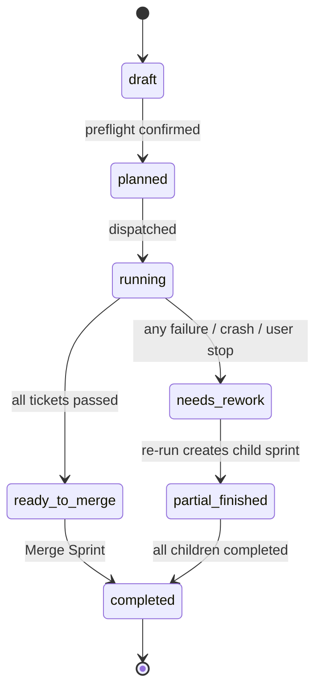

# Sprint Lifecycle Redesign — Source of Truth, States, Merge Model

> **Status:** agreed design; P0 (no same-label re-dispatch) and P1 (unified
> lifecycle enum) implemented — see
> [`../milestones/sprint-lifecycle-redesign.md`](../milestones/sprint-lifecycle-redesign.md).
> Drafted 2026-06-12 from the
> sprint-68.x retrospective (issue #894 / sprint-68.6 ran three times on one
> label and showed Completed, Cancelled, 0 tickets, and a 44-minute wall time
> simultaneously across panes). This document is the contract for the fix
> tickets; companion to [`boundaries.md`](./boundaries.md) and
> [`frontend-map.md`](./frontend-map.md).

## Problem — Four Competing Truths

Today one sprint's status is answered by four disconnected sources, and they
disagree during re-runs, crashes, and dashboard restarts:

| Source | Read by | Example disagreement (sprint-68.6) |
|--------|---------|------------------------------------|
| `GET /api/sprints/:label/outcome` (reads `sprint-N-state.json` + summary `.md`) | Board pane | `completed`, wall 150s |
| `GET /api/sprints/history` (DB `sprints` + `sprint_history` tables + disk fallback) | History pane | `completed`, duration 218s, **0 tickets** |
| `GET /api/sprints/:label/run-stats` (DB `agent_runs`, all attempts) | History expanded card | wall **2670s**, failed coder segments on a "completed" sprint |
| Disk (`plan.json`, `<label>.json`, `-state.json`, `-status.json`) | Everything, at render time | `cancelled` after an orphan-PID sweep, then `completed` |

Root causes: same-label re-dispatch (three attempts under one label), four
state vocabularies (`plan.json` state, DB lifecycle, outcome pane-state,
summary status), and render-time disk reads racing the sprint manager.

## Source-of-Truth Architecture

**GitHub is the truth for state. The local DB is the truth for metrics. Disk
is a write-once run artifact, never read at render time.**

| Layer | Owns | Examples |
|-------|------|----------|
| GitHub | Sprint/ticket state, lineage, review status | issue open/closed, `sprint-68.6` label, `UAT` label, `need-rework` label, PRs, summary issue |
| Local DB | Runtime metrics GitHub never has | durations, per-agent timings, tokens, gantt segments (`agent_runs`, `sprints` tables) |
| Disk (`.commander/sprints/*`) | Sprint-manager runtime artifacts | written during a run, ingested into the DB once at end-of-run |

### Refresh flow (stale-while-revalidate)

```
Browser refresh ──► API serves the cached DB row instantly (no GitHub call in-band)
                └─► background: reconcile against GitHub (labels / issues / PRs / summary issue)
                        └─► if drift found: recompute lifecycle, update DB, push delta to UI
```

- The UI never blocks on GitHub (preserves the instant/offline render that
  issue #805 introduced) but every refresh triggers reconciliation, so drift
  self-heals within seconds.
- Render-time disk reads are **removed** from the outcome and history
  endpoints. The sprint manager writes its files as today, and an end-of-run
  ingest stores the results in the DB.
- Labels are deliberately **not stripped** at completion (see Merge Sprint
  below) so the History pane can rebuild lineage and per-ticket state from
  GitHub alone, without duplicating it in the DB.

## Unified Lifecycle

One enum, used by the board pane, the History pane, the DB, and the APIs.
There is no separate "pane state" vs "lifecycle state".



| State | Meaning | Replaces (legacy) |
|-------|---------|-------------------|
| `draft` | column exists, tickets being arranged, no preflight | `planning` |
| `planned` | preflight confirmed, not yet dispatched | `planning` (auto_run=false) |
| `running` | sprint manager process alive | `running` |
| `ready_to_merge` | run ended, all tickets passed, branch awaiting Merge Sprint | `completed` (pre-merge) |
| `needs_rework` | run ended badly: ticket failure, crash, orphan-PID, **or user cancel** | `failed`, `cancelled`, `has_rework` |
| `partial_finished` | **derived, never stored** — this sprint's tickets moved to a child sprint that is not yet completed | (new) |
| `completed` | merged up the chain, PRs closed, issues closed | `finished` |
| `deleted` | removed via dashboard | `deleted` |

Rules:

- **`cancelled` no longer exists anywhere.** A user cancel or a lost process
  lands in `needs_rework`. The distinction (`stopped by user`, `process lost`,
  `coder failed`, …) is kept as an `end_reason` line shown under the badge,
  written to the run log, and posted to the sprint summary issue. Tickets do
  **not** receive the `need-rework` GitHub label on a user cancel — only
  tickets that actually failed get it.
- **Per-ticket failure → `needs-rework` label is mandatory and immediate.** When
  a ticket fails for a real reason — coder crash, `divergent-branch`, idle/wall
  hang kill, retry cap exhausted, or a final tester rejection — the orchestrator
  MUST transition that ticket from `in-progress`/`SIT` to the `needs-rework`
  label at the point of failure (single writer: `state_machine.transition()`),
  not leave it lingering in `in-progress`/`SIT` for the end-of-run reconcile to
  flag as "stale status labels remain". A *gate* failure that sends the ticket
  back to the coder for a fix-round is the one exception: it stays `SIT` (retry
  in flight), and only flips to `needs-rework` once the fix-round budget is
  exhausted. Sprint-73 shipped five tickets stuck on `in-progress`/`SIT` after
  `divergent-branch` crashes — that is the bug this rule forbids.
- `partial_finished` is computed at read time from children's states, so a
  parent flips to `completed` automatically when its last child completes.
- **Migration is forward-only.** Existing rows render through a display
  mapping (`cancelled`→`needs_rework`, `finished`→`completed`, …); no DB
  rewrite. Pre-redesign sprints with multi-attempt run-stats stay as they are.

## Branch & Merge Model

```
develop
  └── sprint/sprint-68          (base branch, created off develop)
        ├── sprint/sprint-68.1  (child, created OFF THE BASE branch)
        ├── sprint/sprint-68.2
        └── sprint/sprint-68.6
```

- **Child sprint branches are created off the base sprint branch** (today they
  are created off develop — this changes).
- **All children merge back into the base branch**, regardless of depth:
  `68.6 → 68 → develop`, `68.5 → 68 → develop`. The immediate-parent label
  (68.6's parent is 68.5) is **lineage display only** and never affects branch
  targets.
- **Passing work merges to base immediately.** When the tester passes a ticket
  the work is merged child → base and the ticket gets the `UAT` label.
  **`UAT` label literally means "merged to the base branch, awaiting UAT
  review".** This holds even when the run overall is `needs_rework` (mixed
  results): passed tickets' work is on base, so the next child — created off
  base — sees it.
- develop receives code **only at Merge Sprint**.

### Merge Sprint (renames "Finish Sprint")

Merge Sprint is the **human UAT sign-off** — a single click, no per-ticket
approval gate. A confirmation modal lists exactly what will happen:

1. Merge any leftover unmerged child branches into base, in label order.
2. Merge base → develop.
3. Close the sprint's issues and PRs.
4. **Labels are NOT stripped.** `sprint-68.6`, `UAT`, etc. stay on the closed
   issues so GitHub remains the queryable history of which ticket ran in which
   sprint — the History pane reads lineage from labels instead of duplicating
   it in the DB.

## Re-run Rules

- **Same-label re-dispatch is abolished.** Every re-run creates the next child
  sprint (sprint-68 fails → re-run creates and immediately dispatches 68.1; no
  exception for base sprints). One label = one attempt, always.
- Before dispatch, a **confirmation modal** lists the tickets that will move
  to the new child. Eligible tickets exclude:
  - the sprint summary issue, and
  - tickets already carrying the `UAT` label (their work is merged to base).
- If no ticket is eligible to move, Re-run is disabled.
- A sub-sprint is a first-class sprint: its own column, branch, run, history
  row. The only parent linkage is a lineage flag shown on the History pane.

## Board Pane

- Uses the unified lifecycle states above — same badge vocabulary as History.
- **No run-stats, no retry history, no Cancelled badge** on the board. After a
  re-run creates a child, the parent card moves away (or deep-links to
  History); attempt forensics live in History only.
- A done sprint's column (tickets all `UAT`) stays as-is until Merge Sprint;
  the sprint is marked finished when its summary appears in History.
- Action verbs by state: `draft`/`planned` → Run; `running` → Cancel;
  `needs_rework` → Re-run (child); `ready_to_merge` → Merge Sprint;
  `completed` → none.

## History Pane

- **No empty-ticket rows by design.** A sprint whose tickets moved to a child
  shows `partial_finished` with a link to the child — never "0 tickets".
  A parent lists a ticket only while that ticket is its own (e.g. 68.5 shows
  #894 only if #894 passed there and is pending merge).
- **Duration = DB `started_at → ended_at`** (sprint-manager timestamps), one
  number. Per-issue and per-agent breakdowns render inside the expanded card,
  each issue showing its own start → end.
- Verbs by state: `needs_rework` → Re-run; `ready_to_merge` → Merge, Delete;
  `completed` → Merge (no-op guard), Delete only. Nothing else.
- **Auto-refreshes** when a run finishes (same trigger as the board), so a
  stale badge can no longer survive a completed run.
- Lineage: children group under the base sprint; each child row shows which
  sprint it was re-run from.

## Run-stats (History expanded card)

- Scope: **the final (only) attempt** for the label. Because same-label
  re-dispatch no longer exists, `agent_runs` rows for a label are a single
  attempt by construction; wall time, split-bar, and gantt all describe one
  run.
- The crash ✕ marker paints **only** on `needs_rework` sprints. The backend
  `crash` field should not be emitted for clean runs (today it is always set
  and only filtered client-side — verify during implementation).
- Stays behind the expand interaction; header keeps the duration mini only.

## Implementation Themes

Sequencing to be agreed; each theme is independently shippable.

| # | Theme | Main code areas |
|---|-------|-----------------|
| 1 | Lifecycle foundation — new enum in DB + legacy display mapping; derived `partial_finished`; remove all same-label re-dispatch paths | `apps/dashboard/db.py`, `server.py` dispatch routes, `static/src/sprint-board/run-controls.js` |
| 2 | Branch/merge model — children off base; per-pass child→base merge; Merge Sprint (merge children in order → base → develop → close issues/PRs, keep labels); cancel → `needs_rework` + reason to summary issue | `services/sprint_manager/sprint_manager.py`, finish-sprint endpoint |
| 3 | Reconciliation service — GitHub-state reconcile on refresh (stale-while-revalidate); end-of-run disk→DB ingest; remove render-time disk reads from outcome/history endpoints | new router service, `routers/sprint_history_service.py`, outcome endpoint in `server.py` |
| 4 | UI — board: unified badges, no cancelled/run-stats, re-run confirmation modal with ticket-move list; History: `partial_finished`, DB-only duration, auto-refresh, state-gated verbs; run-stats ✕ only on `needs_rework` | `static/src/sprint-board/board-render.js`, `rerun-modal.js`, `project.html` History section |

## Out of Scope / Later

- Rewriting pre-redesign history rows (forward-only migration).
- Splitting historical multi-attempt run-stats into attempts.
- Per-ticket UAT approval gating (Merge Sprint is the single sign-off).
