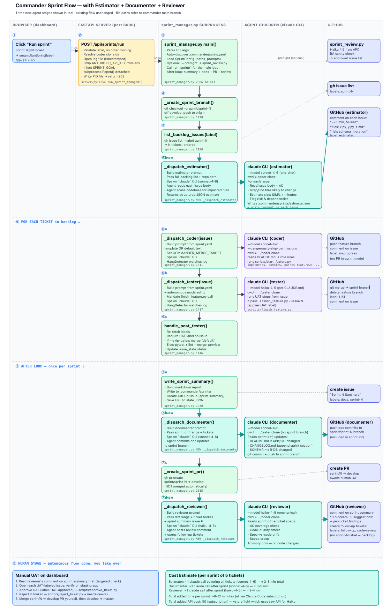

# Sprint Manager

The sprint manager automates the full BA → Coder → Tester → UAT loop for every
ticket in a sprint. It dispatches Claude Code agents as subprocesses, polls for
results, runs quality gates, and generates a sprint summary.



---

## How It Works

A sprint is a GitHub label (`sprint-N`) applied to one or more issues. When you
run a sprint, the manager works through each ticket in order:

1. **Coder** — creates a feature branch, implements the ticket, pushes, moves
   label to `SIT`
2. **Tester** — checks out the branch, writes pytest tests against each AC item,
   runs them, posts a test report, merges to `develop` if tests pass, moves label
   to `UAT`
3. **Gate check** — if the tester rejects the ticket, it is marked failed and
   the next ticket is processed
4. When all tickets are done, a sprint summary issue is filed on GitHub and the
   sprint state JSON is written to `.commander/sprints/`

---

## Planning a Sprint

### From the dashboard

Open the **Sprint Mgmt** tab, select a project, and use the backlog section to
multi-select issues. Click **Plan sprint** to assign the `sprint-N` label to the
selected issues and set a sprint goal.

### From the CLI

```bash
python3 scripts/sprint_planner.py --repo owner/repo --sprint 8 \
  --issues 121 122 123
```

---

## Running a Sprint

### From the dashboard

Click **Run sprint** on the Sprint Mgmt tab. The manager starts in the
background and the dashboard polls `/api/sprint-status` every 5 seconds to
show live progress.

### From the CLI

```bash
python3 apps/dashboard/sprint_manager/sprint_manager.py \
  --sprint sprint-8 --repo zealchaiwut/commander
```

The sprint manager reads worktree paths from `.commander/sprint.yaml` (see
[Sprint Manager Config](../../.commander/README.md)).

---

## Rerunning a Sprint

Click **Rerun sprint** on the Sprint Mgmt tab to reset all ticket labels back
to `backlog` and restart the sprint from the beginning. Useful when a full
sprint failed or when you want to re-verify tickets that were previously skipped.

---

## Killing a Sprint

Click **Kill sprint** (or the inline kill button on a sprint card) to terminate
the running subprocess and mark the sprint stopped. The sprint summary records
the partial results.

---

## Sprint States

| State | What it means |
|---|---|
| `planned` | Sprint label assigned, not yet running |
| `running` | Manager subprocess active |
| `stopped` | Killed or timed out before completion |
| `completed` | All tickets reached UAT or were skipped/failed |

---

## Sprint Summary

When a sprint finishes (or is stopped), the manager generates a Markdown summary
and files it as a GitHub issue with the `sprint-summary` label. The summary
includes:

- What shipped (ticket, time taken, outcome)
- What didn't ship (failure category and reason)
- Stats: total tokens, avg ticket time, quality-gate pass rate, cost estimate
- Suggested follow-up actions

Sprint state files are also written to `.commander/sprints/sprint-N-state.json`
and `.commander/sprints/sprint-N-summary-YYYY-MM-DD.md`.

---

## Quality Gates

After the tester exits 0, the sprint manager runs five gates in this order
(cheap/deterministic first so bad tickets fail before expensive gates):

| # | Gate | Tool | Skip env var |
|---|------|------|-------------|
| 1 | **typecheck** | mypy (Python), tsc --noEmit (TypeScript) | `COMMANDER_GATE_TYPECHECK=0` |
| 2 | **lint** | ruff (Python), eslint/biome + prettier (JS/TS) | `--no-gate-lint` |
| 3 | **design** | `npx impeccable detect` — UI anti-pattern detector, no LLM | `COMMANDER_GATE_DESIGN=0` |
| 4 | **pytest** | pytest -x on changed test files | `--no-gate-pytest` |
| 5 | **merge-preview** | `git merge --no-commit --no-ff` dry run | `--no-gate-merge-preview` |

Gates stop on first failure — the issue is reverted to SIT and a structured
comment is posted. All gates are individually skippable via CLI flags or env
vars. Pass `--skip-gates` to bypass all gates and force-merge (use with caution).

Gates that don't find the required tool (mypy, tsc, eslint, impeccable) skip
gracefully with a warning rather than failing the build.

---

## Coder TDD Workflow

The coder prompt instructs the agent to follow TDD:

1. Read the issue's `## Acceptance Criteria` section
2. Write pytest tests that encode each criterion **before** any implementation
3. Implement until all tests pass
4. Tests must not be deleted, skipped, or weakened to achieve a passing run

If the project has `PRODUCT.md` and `DESIGN.md` at the repo root, the coder
reads them before touching frontend/UI files. Use these to codify design
conventions and anti-patterns.

---

## Configuration

Sprint manager reads `.commander/sprint.yaml`. After cloning, run:

```bash
./.commander/setup.sh
```

Key fields:

```yaml
repo_name: owner/repo

worktrees:
  coder: /path/to/coder-clone
  tester: /path/to/tester-clone

paths:
  scripts_dir: /path/to/scripts
  logs_dir: /path/to/.commander/logs
  sprints_dir: /path/to/.commander/sprints

dashboard:
  api_url: http://localhost:8000
```

---

## Agent Models

| Agent | Default model | Notes |
|---|---|---|
| Coder | `claude-sonnet-4-6` | Via Claude Code CLI (subscription-funded) |
| Tester | `claude-haiku-4-5` | Via Claude Code CLI (subscription-funded) |
| Sprint preflight | `claude-haiku-4-5-20251001` | Raw API (charged per token) |

Override per-invocation with `--model` on the CLI or in `sprint.yaml`.

---

## Useful Scripts

| Script | What it does |
|---|---|
| `scripts/sprint_planner.py` | Assign issues to a sprint label |
| `scripts/sprint_review.py` | Run the BA preflight review before a sprint starts |
| `scripts/sprint_init.py` | Initialise a sprint state file |
| `scripts/start_feature.py` | Coder: create and push a feature branch |
| `scripts/finish_feature.py` | Tester: merge feature branch to develop |
| `scripts/post_test_report.py` | Tester: post structured test report as issue comment |
| `scripts/create_ticket.py` | BA: file a new GitHub issue from the feature template |
| `scripts/update_ticket.py` | Move a ticket label (in-progress, SIT, UAT, blocked) |
| `scripts/comment_ticket.py` | Add a comment to an issue |
| `scripts/approve_ticket.py` | Approve a UAT ticket (sets UAT-approved, closes issue) |
| `scripts/reject_ticket.py` | Reject a UAT ticket (sets needs-rework) |
